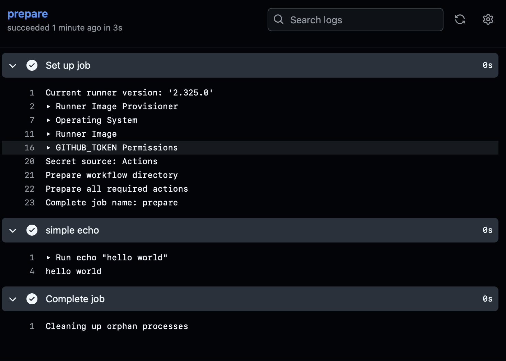
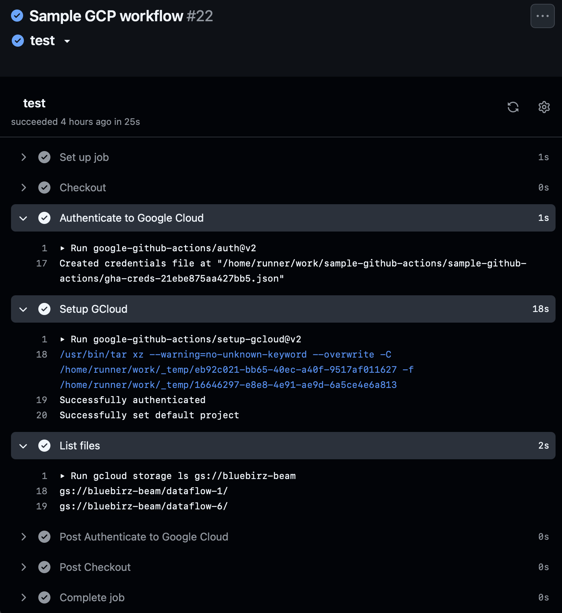

# sample-github-actions

Sample repo for Github actions

## about

- This repo is for demonstrating how to setup GCP Workload Identity Federation and Github Actions.
- It is written aside blogs described below.

## blog related

- [Blog] [Let's try: Github actions for Github integration](https://bluebirz.net/posts/try-github-actions/)
- [Medium] [Let's try: Github actions for Github integration](https://medium.com/@bluebirz/lets-try-github-actions-for-github-integration-241398ca59a6)

## How to run

### Prerequisites

- [Terraform](https://developer.hashicorp.com/terraform)
- [Google Cloud Platform account](https://cloud.google.com/)
- [Github account](https://github.com/)

### Executions

#### GCP Workload Identity Federation via Terraform

1. `cd terraform`
1. `terraform init`
1. update variables in `./terraform/vars.tfvars`.
1. `terraform validate`
1. `terraform plan -var-file=vars.tfvars`
1. `terraform apply -var-file=vars.tfvars -auto-approve`
1. There should display outputs like this.  

    ```
    pool_name        = "projects/<project_number>/locations/global/workloadIdentityPools/<pool_name>"
    pool_provider_id = "projects/<project_id>/locations/global/workloadIdentityPools/<pool_name>/providers/<provider_name>"
    sa_email         = "<sa_id>@<project_id>.iam.gserviceaccount.com"
    ```

#### Github Actions

1. `cd .github/workflows`
1. "sample.yml" is a simple workflow just to `echo "hello world"`.
1. "sample-gcp-githubaction.yml" is a workflow to list files and folders in the given GCS path.  
    1. update `PROJECT_ID`, `WLID_PROVIDER`, `SA_EMAIL` under `env` according to the outputs from Terraform step.
    1. commit and push.
    1. run the workflow in the "Actions" tab in Github and see the results.

### Sample results

#### "sample.yml"



#### "sample-gcp-githubaction.yml"


